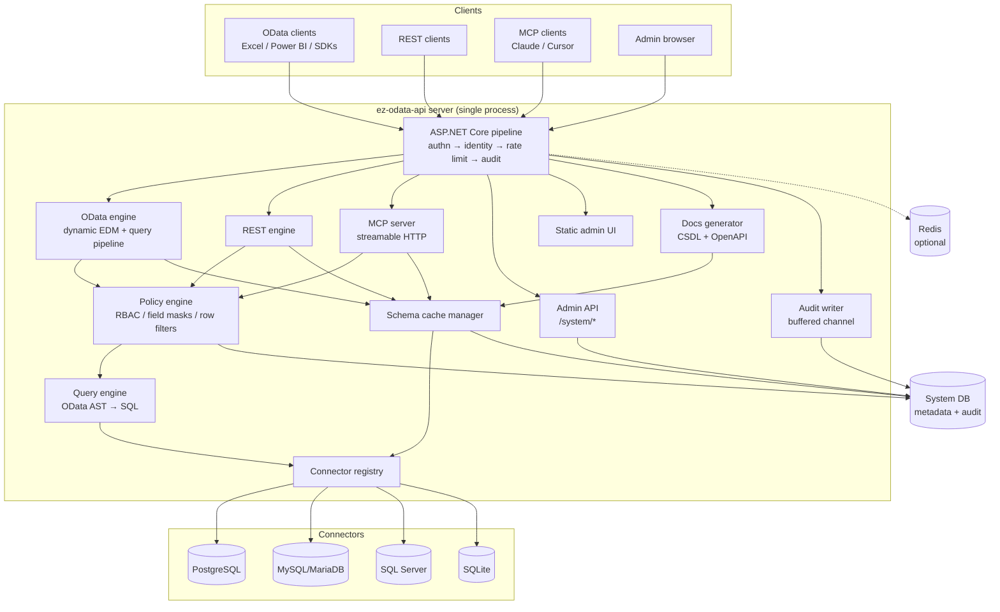
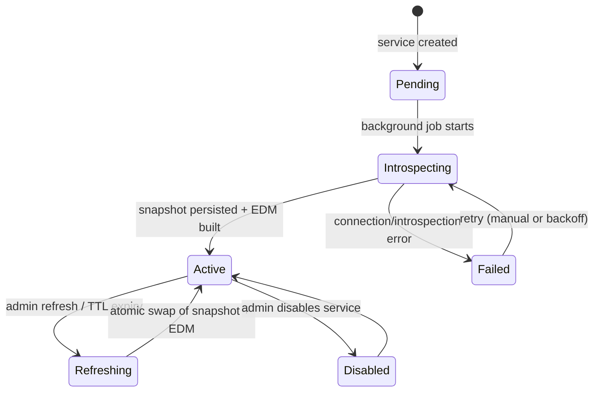

# 02 — System Architecture

## 1. Technology Stack

| Layer | Choice | Rationale |
|-------|--------|-----------|
| Runtime | Engine: **.NET Standard 2.0** (runs on .NET Framework 4.8 *and* modern .NET); standalone server: **.NET 10 (LTS)**, C# 14 (latest LangVersion everywhere via polyfills) | §1.1 — a hard requirement is hosting inside existing .NET Framework 4.8 ASP.NET sites |
| Web framework | **Thin host adapters** over a host-agnostic engine: ASP.NET Core adapter (net8.0/net10.0) + classic **ASP.NET Web API 2 / OWIN adapter (net48)** | The engine speaks an abstract request/response contract; adapters are small |
| OData | **ODataLib 7.x used directly**: `Microsoft.OData.Core` + `Microsoft.OData.Edm` 7.x — `ODataUriParser` for URL/query-option parsing, `ODataMessageWriter/Reader` for payloads, `CsdlWriter` for `$metadata` | ODL 7.x targets netstandard2.0/.NET Framework 4.5+ and is Microsoft's maintained line for exactly this scenario (ODL 8+ is net8.0-only). We do **not** depend on `Microsoft.AspNetCore.OData`: we already owned routing and AST→IR translation, so the host-integration layer we forgo is small — and dropping it is what makes one engine run on every host |
| MCP | **ModelContextProtocol.AspNetCore ≥ 1.4** (official C# SDK) | Streamable HTTP transport; **modern .NET hosts only** (no net48 — §1.1) |
| Data access | **ADO.NET providers** behind our own connector abstraction: `Npgsql` (pinned to the **8.x line** — last to support .NET Framework), `MySqlConnector`, `Microsoft.Data.SqlClient`, `Microsoft.Data.Sqlite` (netstandard2.0-compatible versions) | We translate OData ASTs to SQL ourselves; an ORM (EF) cannot model runtime-discovered schemas efficiently |
| SQL building | Internal `SqlBuilder` per dialect (no third-party query DSL) | Full control of parameterization, quoting, paging dialect differences |
| System DB | **EF Core 10** over PostgreSQL (prod) / SQLite (dev, default) | Migrations, simple metadata CRUD; system DB schema is compile-time-known |
| Cache / rate limit store | In-memory by default; **Redis optional** (`StackExchange.Redis`) for multi-node | NFR-5 |
| AuthN | JWT (HS256/RS256) via `Microsoft.AspNetCore.Authentication.JwtBearer`; API keys via custom handler | doc 08 |
| Admin UI | **React 19 + TypeScript + Vite**, served as static assets from the same process | doc 10 |
| OpenAPI | `Microsoft.OpenApi` document model, generated from schema cache (not reflection) | doc 11 |
| Logging/metrics | `Microsoft.Extensions.Logging` → OpenTelemetry (OTLP), Prometheus metrics endpoint | doc 12 |
| Packaging | Single Docker image (multi-arch), `docker-compose.yml`, Helm chart | doc 12 |

### 1.1 Framework Targeting Strategy (normative)

The platform must be embeddable in existing **.NET Framework 4.8** ASP.NET websites (a hard customer requirement) while the standalone server uses modern .NET. Resolution: the entire engine targets `netstandard2.0`; platform-specific code lives in host adapters and the standalone Host.

| Project group | TFM(s) | Notes |
|---------------|--------|-------|
| `Core`, `Connectors.Abstractions`, `Connectors.*`, `OData` (engine), `Rest` (engine), `Docs` | `netstandard2.0` | Modern C# via polyfills (PolySharp); no ASP.NET/EF references; `System.Text.Json`, `Microsoft.Extensions.*` abstractions, `System.Threading.Channels` all have netstandard2.0 packages |
| `EzOdata.AspNetCore` (adapter) | `net8.0;net10.0` | Maps ASP.NET Core HTTP ↔ engine contract; `MapEzOData()` etc. |
| `EzOdata.WebApi` (adapter) | `net48` | Classic ASP.NET Web API 2 / OWIN `HttpMessageHandler`; `config.MapEzOData()` |
| `Data` (EF system store), `Admin`, `Mcp`, `Host` | `net10.0` | Standalone-server concerns; EF Core, MCP SDK, Argon2id/AesGcm, admin UI hosting |

Feature availability by host:

| Capability | Modern .NET host / standalone | .NET 4.8 embedded host |
|------------|-------------------------------|------------------------|
| OData v4 + REST endpoints, full security pipeline, docs generation | Yes | Yes |
| System DB, admin API/UI, runtime service management | Yes | No (code/config-defined services — doc 15) |
| MCP server | Yes | No (MCP SDK requires modern .NET; documented limitation) |
| AES-GCM secret encryption at rest | Yes | N/A (host app owns its connection strings) |

Platform-API constraints this imposes (enforced by the netstandard2.0 TFM itself): no `AesGcm`/`Argon2` in engine projects (they live in `Data`/`Host`), no `Span`-dependent APIs beyond what `System.Memory` provides, provider versions capped at their last netstandard2.0-compatible lines (notably Npgsql 8.x).

## 2. Component Diagram



Critical property: **OData, REST, and MCP all converge on the same policy engine and query engine.** There is exactly one code path that authorizes and executes a data operation; the three protocols are thin front-ends that produce a common intermediate representation (see §6).

## 3. Solution Layout

```
ez-odata-api/
├── src/
│   ├── EzOdata.Host/                 # ASP.NET Core entrypoint, DI composition, middleware
│   ├── EzOdata.Core/                 # Domain: services, roles, identity, policy engine,
│   │                                 #   schema model, query IR, abstractions (no ASP.NET refs)
│   ├── EzOdata.Data/                 # EF Core system-DB context, entities, migrations, repos
│   ├── EzOdata.Connectors.Abstractions/  # IDbConnector, ISchemaIntrospector, ISqlDialect
│   ├── EzOdata.Connectors.PostgreSql/
│   ├── EzOdata.Connectors.MySql/
│   ├── EzOdata.Connectors.SqlServer/
│   ├── EzOdata.Connectors.Sqlite/
│   ├── EzOdata.OData/                # Dynamic EDM builder, ODL-direct serving engine,
│   │                                 #   OData AST → Query IR translation (netstandard2.0)
│   ├── EzOdata.Rest/                 # REST dialect engine → Query IR (netstandard2.0)
│   ├── EzOdata.AspNetCore/           # ASP.NET Core host adapter (net8.0/net10.0)
│   ├── EzOdata.WebApi/               # Classic ASP.NET Web API 2 host adapter (net48)
│   ├── EzOdata.Mcp/                  # MCP tool definitions → Query IR (net10.0)
│   ├── EzOdata.Admin/                # /system management API controllers (net10.0)
│   └── EzOdata.Docs/                 # CSDL & OpenAPI generation (netstandard2.0)
├── ui/                               # React admin console (built into Host wwwroot)
├── tests/
│   ├── EzOdata.UnitTests/
│   ├── EzOdata.IntegrationTests/     # Testcontainers: pg/mysql/mssql + system DB
│   └── EzOdata.ConformanceTests/     # OData conformance suite (doc 13)
├── deploy/                           # Dockerfile, compose, helm/
├── spec/                             # This specification
└── EzOdata.sln
```

Dependency rule: `Core` references nothing platform-specific. `Connectors.*` reference only `Connectors.Abstractions` + their ADO.NET provider. Protocol projects (`OData`, `Rest`, `Mcp`, `Admin`) reference `Core`. `Host` references everything and is the only composition root.

This layering is load-bearing for the second distribution channel: `Core`, `Connectors.*`, `OData`, `Rest`, and `Mcp` are also published as the embeddable `EzOdata.AspNetCore.*` NuGet packages (doc 15), with storage/policy/audit behind `IMetadataStore`/`IPolicySource`/`IAuditSink` abstractions so the same engine runs inside a customer's existing ASP.NET Core app without the system DB or admin UI.

### 3.1 Design Principles (normative)

Two engineering principles are mandatory across the codebase and are enforced in review and CI (doc 13 §0, §8):

**Interface Segregation Principle (ISP).** Consumers depend only on the capabilities they use; no class is forced to implement members it doesn't need.

- Abstractions are **role interfaces**, not header interfaces: one responsibility per interface, typically 1–4 members. The connector surface is the canonical example — segregated into `IConnectionTester`, `ISchemaIntrospector`, `IQueryExecutor`, `IWriteExecutor`, `ISqlDialect` (doc 04 §2) rather than one fat `IDbConnector`.
- Protocol layers declare dependencies on the narrowest interface that serves them: the OData read path injects `IQueryExecutor`, never the write or introspection surfaces; the docs generator injects `ISchemaSnapshotReader`, not the full metadata store.
- Storage/policy/audit seams follow the same rule: `IMetadataStore` is a composition of `IServiceCatalogReader`, `IServiceCatalogWriter`, `ISchemaSnapshotStore`; `IPolicySource` exposes only rule retrieval, not rule persistence; `IAuditSink` is write-only (`IAuditQuery` is a separate, admin-API-only interface).
- Read and write capabilities are always separate interfaces, so read-only configurations (read-only services, embedded read-only mode, the docs generator) are typed as unable to write rather than runtime-guarded.
- Review heuristics that trigger redesign: an interface member implemented with `throw new NotSupportedException`; a mock setting up members the test never verifies; an interface whose name is a layer ("Manager", "Helper") rather than a role.

**Test-Driven Development (TDD).** All production code in `Core`, `OData`, `Rest`, `Mcp`, and `Connectors.*` is written test-first; doc 13 §0 defines the workflow, scope boundaries, and how TDD composes with the conformance suite (spec-as-failing-tests). ISP and TDD reinforce each other here: small role interfaces are what make the policy engine, SQL compiler, and parsers testable with cheap hand-rolled fakes instead of deep mock graphs.

## 4. Request Pipeline (data path)

Middleware order in `EzOdata.Host` for `/api/*` and `/mcp`:

1. **Exception shield** — converts unhandled exceptions to RFC 9457 problem details (REST/admin) or OData error format (OData routes); never leaks SQL or stack traces in production.
2. **Request ID + W3C trace context** — `traceparent` honored; `X-Request-Id` echoed.
3. **HTTPS redirection / HSTS** (configurable off for dev).
4. **CORS** — per-instance config; admin can whitelist origins per App (doc 08 §8).
5. **Authentication** — composite scheme: API key (`X-API-Key` header or `api_key` query param) and/or JWT bearer. Builds the **RequestIdentity** (App, User, effective Role(s)).
6. **Rate limiter** — token bucket keyed by App or User per doc 08 §7; emits `429` + `Retry-After`.
7. **Service resolver** — extracts `{service}` from the route, loads the service descriptor + schema cache reference; `404` if unknown, `503 ServiceUnavailable` if service is disabled or introspection pending.
8. **Authorization gate (coarse)** — verifies the identity's role grants *any* access to this service; fine-grained checks happen in the policy engine per-operation.
9. **Protocol handler** — OData / REST / MCP / docs.
10. **Audit tap** — request/response summary enqueued to the audit channel (non-blocking).

## 5. Dynamic EDM Model & ODL-Direct Serving Strategy

The hardest technical problem: entity types are discovered at runtime and differ per service, and the engine must run on every host from .NET Framework 4.8 to .NET 10. Both constraints are solved the same way — by using ODataLib directly and owning the HTTP-to-engine boundary.

**Decisions:**

1. **One `IEdmModel` per service**, built by `EdmModelFactory` (EdmLib `EdmModel`/`EdmEntityType` construction) from the schema cache (doc 04 defines the schema model; doc 05 §3 defines the mapping rules). Models are immutable and cached; rebuilding happens only on schema refresh, atomically swapping the reference.
2. **Host-agnostic engine contract.** The OData engine exposes `ODataRequestHandler.HandleAsync(EngineRequest, CancellationToken) → EngineResponse`, where `EngineRequest` carries method, service-relative path, query string, headers, identity, and body stream. Host adapters (`EzOdata.AspNetCore`, `EzOdata.WebApi`) are mechanical translations of their HTTP abstractions to this contract — no protocol logic lives in adapters.
3. **URL/query parsing via `ODataUriParser`** against the per-service model: path segments (entity set, key, property, `$count`, `$metadata`) and query options (`FilterClause`, `OrderByClause`, `SelectExpandClause`, …) come from the official parser, then translate to our **Query IR** (§6), which connectors compile to SQL. No `IQueryable`, no in-memory evaluation.
4. **Serialization via `ODataMessageWriter`.** Result rows are streamed as `ODataResource`/`ODataResourceSet` instances constructed directly from connector row data (no CLR entity materialization, no `EdmEntityObject` intermediary); `CsdlWriter` emits `$metadata` XML/JSON. This is the piece `Microsoft.AspNetCore.OData` would normally own; doing it ourselves costs a bounded writer layer and buys net48 compatibility plus full control of trimming/masking during serialization.
5. **Model versioning.** Each built model carries a `SchemaVersion` (hash of the schema cache). ETag-style `$metadata` caching uses this hash.

## 6. Query Intermediate Representation (Query IR)

All three protocols produce the same IR consumed by the policy engine and connectors:

```csharp
// EzOdata.Core — illustrative shape, not final code
public sealed record QueryRequest(
    ServiceRef Service,
    TableRef Table,                    // resolved entity set → schema table
    FilterNode? Filter,                // boolean expression tree (see below)
    IReadOnlyList<OrderBy> OrderBy,
    IReadOnlyList<FieldRef>? Select,   // null = all permitted fields
    IReadOnlyList<ExpandNode> Expand,  // related-entity subtrees with their own Filter/Select/Top
    int? Top, int? Skip,
    bool Count,                        // $count=true
    IReadOnlyList<Aggregation>? Apply  // $apply groupby/aggregate subset
);

public abstract record FilterNode;
public sealed record ComparisonNode(FieldRef Field, ComparisonOp Op, ConstantValue Value) : FilterNode;
public sealed record LogicalNode(LogicalOp Op, IReadOnlyList<FilterNode> Operands) : FilterNode;
public sealed record NotNode(FilterNode Operand) : FilterNode;
public sealed record FunctionNode(FilterFunction Fn, IReadOnlyList<FilterArg> Args) : FilterNode; // contains/startswith/...
public sealed record InNode(FieldRef Field, IReadOnlyList<ConstantValue> Values) : FilterNode;

public sealed record WriteRequest(
    ServiceRef Service, TableRef Table, WriteKind Kind,   // Insert | Update | Replace | Delete
    IReadOnlyList<RecordPayload> Records,                  // 1..n (bulk)
    KeyPredicate? Key,                                     // single-record ops
    FilterNode? Precondition                               // optimistic concurrency / row filter
);
```

Pipeline for every operation:

```
protocol parse → IR → PolicyEngine.Authorize(identity, IR)
              → (IR rewritten: row filters AND-ed in, field masks applied to Select/Expand)
              → Connector.Compile(IR) → parameterized SQL → execute → shape → protocol serialize
```

`PolicyEngine.Authorize` either throws (403 with reason code) or returns a **rewritten IR** — security is enforced by construction in the query itself (e.g. a denied field can never appear in SELECT, ORDER BY, or WHERE; a row filter is always AND-ed), not by post-filtering results.

## 7. Schema Cache Lifecycle



- Snapshots are persisted in the system DB (`schema_snapshots`, doc 03) so a restart does not require re-introspection.
- Refresh runs against a copy; in-flight requests keep using the old snapshot until the swap (NFR-4).
- A `schema drift` warning state is set if a runtime query fails with "column/table not found"; the service stays Active but the console surfaces a refresh suggestion.

## 8. Concurrency & State

- The process is **stateless apart from caches**; all durable state lives in the system DB. Multiple replicas can run behind a load balancer if Redis is configured (rate limit counters, distributed cache invalidation via pub/sub channel `ez:invalidate:{serviceId}`).
- Connection pooling: one ADO.NET pool per service (provider-native pooling), with per-service `MaxPoolSize` configurable (default 50). Pools are disposed when a service is deleted/disabled.
- Long queries: per-service command timeout (default 30 s); cancellation tokens propagate from the HTTP request abort.

## 9. Error Model (cross-cutting)

| Condition | OData routes | REST/admin routes |
|-----------|--------------|-------------------|
| Format | OData v4 JSON error (`{"error":{"code","message","details"}}`) | RFC 9457 `application/problem+json` |
| Auth missing/invalid | 401 + `WWW-Authenticate` | 401 |
| Authorization denied | 403, code `Forbidden.<reason>` (e.g. `Forbidden.FieldDenied`) | 403 |
| Unknown service/entity | 404 | 404 |
| Validation (bad filter, bad payload) | 400 with parser detail | 400 |
| Conflict (key exists, FK violation) | 409, code mapped from connector error taxonomy (doc 04 §8) | 409 |
| Precondition failed (ETag) | 412 | 412 |
| Rate limited | 429 + `Retry-After` | 429 |
| Target DB unreachable | 503, code `Upstream.Unavailable` | 503 |
| Query timeout | 504, code `Upstream.Timeout` | 504 |

Internal error codes are stable, documented strings (consumed by the UI and tests). SQL text and stack traces are logged server-side with the request ID, never returned to clients in production mode.

## 10. Configuration Model

Configuration follows standard .NET layering: `appsettings.json` → environment variables (`EZODATA__` prefix) → CLI args. Full key reference in doc 12 §4. Notable top-level sections: `SystemDatabase`, `Auth` (JWT signing, key hashing), `Encryption` (master key / KMS), `RateLimiting`, `Redis`, `Cors`, `Telemetry`, `Mcp`.

## 11. Versioning

- Platform API surface is versioned by URL prefix: `/api/v1/...` is implied; v1 routes are served at both `/api/...` and `/api/v1/...`. Breaking changes introduce `/api/v2`.
- OData services advertise `OData-Version: 4.0` and accept `4.0` (4.01 features like key-as-segment are enabled where harmless; see doc 05 §10).
- The system DB schema is migrated automatically on startup (EF migrations) with a startup lock to support multi-replica deploys.
