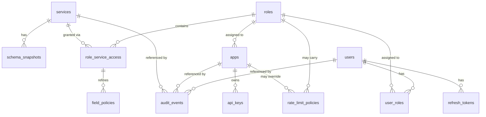

# 03 — System Data Model (Metadata Store)

The **system database** holds all platform state: services, schema snapshots, identity, RBAC, rate limits, and audit. It is owned by EF Core 10 migrations. Production default is PostgreSQL; SQLite is supported for development/single-node.

Conventions: `snake_case` table/column names; surrogate `id BIGINT GENERATED ALWAYS AS IDENTITY` PKs unless noted; all timestamps `timestamptz` UTC named `*_at`; soft deletes only where noted; every mutable table has `created_at`, `updated_at`, and `row_version` (concurrency token).

## 1. Entity-Relationship Overview



## 2. Tables

### 2.1 `services`

One row per connected data source.

| Column | Type | Notes |
|--------|------|-------|
| id | bigint PK | |
| name | varchar(64) UNIQUE | URL slug; regex `^[a-z][a-z0-9_-]{1,62}$`; immutable after creation |
| label | varchar(128) | Display name |
| description | text NULL | |
| connector_type | varchar(32) | `postgresql` \| `mysql` \| `sqlserver` \| `sqlite` |
| connection_encrypted | bytea | AES-256-GCM envelope of the connection JSON (doc 08 §9). Never returned by APIs. |
| connection_fingerprint | varchar(64) | SHA-256 of normalized host+db (for display: `host/db`, no secrets) |
| options_json | jsonb | Connector options: schema include/exclude globs, max page size, command timeout, pool size, read_only flag |
| status | varchar(16) | `pending` \| `introspecting` \| `active` \| `failed` \| `refreshing` \| `disabled` |
| status_detail | text NULL | Last error message for `failed` |
| schema_refresh_minutes | int NULL | TTL auto-refresh; NULL = manual only |
| is_deleted | bool | Soft delete (name freed by suffixing) |

`options_json` contract (validated against JSON Schema at write time):

```json
{
  "includeSchemas": ["public"],
  "excludeTables": ["audit_*", "tmp_*"],
  "includeViews": true,
  "readOnly": false,
  "defaultPageSize": 25,
  "maxPageSize": 1000,
  "commandTimeoutSeconds": 30,
  "maxPoolSize": 50,
  "exposedNameStyle": "original"
}
```

### 2.2 `schema_snapshots`

Persisted result of introspection (doc 04 §5 defines the snapshot JSON contract).

| Column | Type | Notes |
|--------|------|-------|
| id | bigint PK | |
| service_id | bigint FK→services | |
| version_hash | varchar(64) | SHA-256 of canonicalized snapshot JSON; used as `$metadata` ETag |
| snapshot_json | jsonb | Full normalized schema model (tables, columns, keys, relationships) |
| table_count / view_count | int | Denormalized for UI |
| introspected_at | timestamptz | |
| is_current | bool | Exactly one current row per service (partial unique index) |

Old snapshots retained (last 5) for diffing in the UI ("schema changes since last refresh").

### 2.3 `roles`

| Column | Type | Notes |
|--------|------|-------|
| id | bigint PK | |
| name | varchar(64) UNIQUE | |
| description | text NULL | |
| is_active | bool | Inactive role ⇒ all bound identities get 403 |
| is_admin | bool | Grants full `/system/*` access; data access still goes through rules unless `bypass_data_rules` |
| bypass_data_rules | bool | Superuser data access (use sparingly; audit-flagged) |

### 2.4 `role_service_access`

The RBAC matrix. One row = one grant. Evaluation semantics in doc 08 §5.

| Column | Type | Notes |
|--------|------|-------|
| id | bigint PK | |
| role_id | bigint FK→roles | |
| service_id | bigint FK→services NULL | NULL = "any service" (wildcard grant) |
| resource_pattern | varchar(256) | Table/view name glob against exposed names: `*`, `Customers`, `sales_*`. Case-insensitive. |
| verbs | int (bitmask) | 1=GET, 2=POST, 4=PUT, 8=PATCH, 16=DELETE |
| row_filter | text NULL | OData `$filter` expression AND-ed into every query/write predicate. May reference identity claims as `@identity.<claim>` (doc 08 §5.4) |
| priority | int | Higher wins when multiple rows match the same resource (deny/allow composition, doc 08 §5.2) |
| effect | varchar(8) | `allow` \| `deny` |

### 2.5 `field_policies`

Field-level security attached to a grant.

| Column | Type | Notes |
|--------|------|-------|
| id | bigint PK | |
| role_service_access_id | bigint FK | |
| field_pattern | varchar(128) | Column name or glob within matched tables |
| action | varchar(8) | `deny` (never readable/writable/filterable) \| `mask` (returned as masked literal) \| `writeonly` (accepted on write, never returned) |
| mask_value | varchar(64) NULL | e.g. `"***"`; for `mask` only |

### 2.6 `users`

Local platform users (admins and optional named API users).

| Column | Type | Notes |
|--------|------|-------|
| id | bigint PK | |
| email | citext UNIQUE | Login identifier |
| display_name | varchar(128) | |
| password_hash | varchar(256) | Argon2id (doc 08 §3.2); NULL if SSO-only (future) |
| is_active | bool | |
| is_system_admin | bool | Bootstrap superadmin flag (first-run setup) |
| last_login_at | timestamptz NULL | |
| failed_login_count / locked_until | int / timestamptz NULL | Lockout policy doc 08 §3.3 |

### 2.7 `user_roles`

`(user_id, role_id)` many-to-many, both FK, composite PK.

### 2.8 `apps`

A registered API consumer (maps 1:1 to DreamFactory "App").

| Column | Type | Notes |
|--------|------|-------|
| id | bigint PK | |
| name | varchar(64) UNIQUE | |
| description | text NULL | |
| role_id | bigint FK→roles | Exactly one role per app |
| is_active | bool | |
| allowed_origins | text[] NULL | CORS whitelist for this app's key |
| require_user_session | bool | If true, the key alone is not enough; a user JWT must also be present (key identifies the app, JWT the person) |
| mcp_enabled | bool | Default true; when false, this app's keys are rejected at the MCP endpoint (doc 09 MCP-7) |

### 2.9 `api_keys`

| Column | Type | Notes |
|--------|------|-------|
| id | bigint PK | |
| app_id | bigint FK→apps | |
| key_prefix | varchar(12) | First 12 chars, displayable (`ez_live_AbC1`) |
| key_hash | varchar(128) | SHA-256 of full key; full key shown exactly once at creation |
| name | varchar(64) | e.g. "prod", "staging" |
| expires_at | timestamptz NULL | |
| revoked_at | timestamptz NULL | |
| last_used_at | timestamptz NULL | Updated lazily (≥ 1 min granularity) |

### 2.10 `rate_limit_policies`

| Column | Type | Notes |
|--------|------|-------|
| id | bigint PK | |
| scope_type | varchar(16) | `app` \| `role` \| `user` \| `service` \| `instance` |
| scope_id | bigint NULL | NULL for `instance` |
| window_seconds | int | e.g. 60 |
| max_requests | int | |
| verbs | int NULL | Optional bitmask to limit only writes, etc. |

Resolution order and combination semantics: doc 08 §7.

### 2.11 `refresh_tokens`

| Column | Type | Notes |
|--------|------|-------|
| id | uuid PK | |
| user_id | bigint FK | |
| token_hash | varchar(128) | |
| expires_at / revoked_at | timestamptz | Rotation on use (doc 08 §3.4) |
| created_by_ip / user_agent | inet / text | Session listing in UI |

### 2.12 `audit_events`

Append-only. Partitioned by month (PostgreSQL native partitioning); SQLite uses a plain table.

| Column | Type | Notes |
|--------|------|-------|
| id | bigint PK | |
| occurred_at | timestamptz | Partition key |
| request_id | varchar(64) | Correlates with logs/traces |
| category | varchar(24) | `data.read` \| `data.write` \| `auth` \| `admin` \| `mcp` \| `system` |
| action | varchar(64) | e.g. `query`, `insert`, `login.failed`, `role.updated`, `tool.call` |
| outcome | varchar(8) | `ok` \| `denied` \| `error` |
| service_id / app_id / user_id / role_id | bigint NULL | Denormalized principals |
| resource | varchar(256) NULL | e.g. `Customers`, `system/roles/12` |
| detail_json | jsonb | Verb, filter text, row count, duration ms, error code, client IP. **Never row data or credentials.** |
| duration_ms | int NULL | |

Retention: configurable (default 90 days); pruning job drops whole partitions.

### 2.13 `system_settings`

Key-value (`key varchar(64) PK`, `value_json jsonb`) for mutable instance settings editable in the UI (e.g. default CORS, docs visibility, MCP enabled). Immutable/secret config stays in environment configuration (doc 12).

### 2.14 `jobs`

Background job bookkeeping (introspection, snapshot pruning, audit pruning): `id, kind, service_id NULL, status, started_at, finished_at, error`.

## 3. Indexing Strategy (system DB)

- `services(name) UNIQUE WHERE NOT is_deleted`
- `schema_snapshots(service_id) UNIQUE WHERE is_current`
- `api_keys(key_hash) UNIQUE` — the hot lookup on every keyed request; cached in-memory with 60 s TTL + pub/sub invalidation
- `role_service_access(role_id, service_id)`
- `audit_events(occurred_at)` (partition), `audit_events(app_id, occurred_at)`, `audit_events(service_id, occurred_at)`
- `refresh_tokens(token_hash) UNIQUE`

## 4. Seed / Bootstrap Data

First-run behavior (`OPS-3`, doc 12 §6):

1. If `users` is empty, the server enters **setup mode**: `/setup` UI + `POST /system/setup` accept exactly one request creating the first system admin; all other routes return 503 with a setup hint.
2. Migration seeds two roles: `admin` (`is_admin=true, bypass_data_rules=true`) and `read-only-all` (allow GET on `*` of every service) — the latter inactive by default.
3. No default API keys are created. No default service is created (the Docker compose dev profile seeds a sample `northwind` PostgreSQL service for demos).

## 5. Data Integrity Rules

- Deleting a **role** is blocked while any app or user references it (`409` with referencing list).
- Deleting a **service** soft-deletes it, disposes its connection pool, removes EDM/model caches, and cascades hard-delete of snapshots; audit rows keep the `service_id` (no FK to deleted check).
- Deleting an **app** revokes (not deletes) its keys; audit retains rows.
- `role_service_access.row_filter` is validated at write time by parsing with the OData filter grammar against the *current* snapshot of the target service when `service_id` is set; wildcard grants validate lazily at evaluation (invalid filter ⇒ deny + audit `error`).
